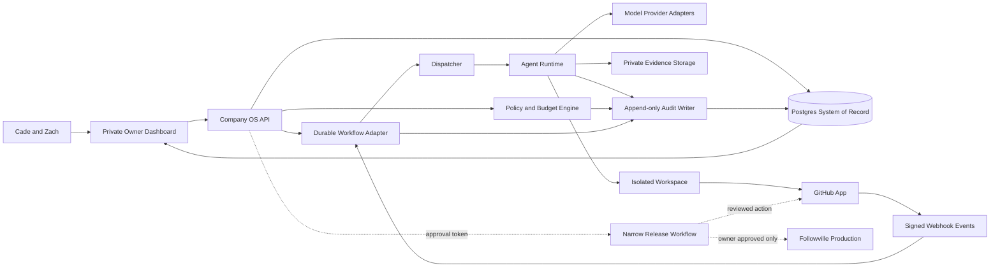
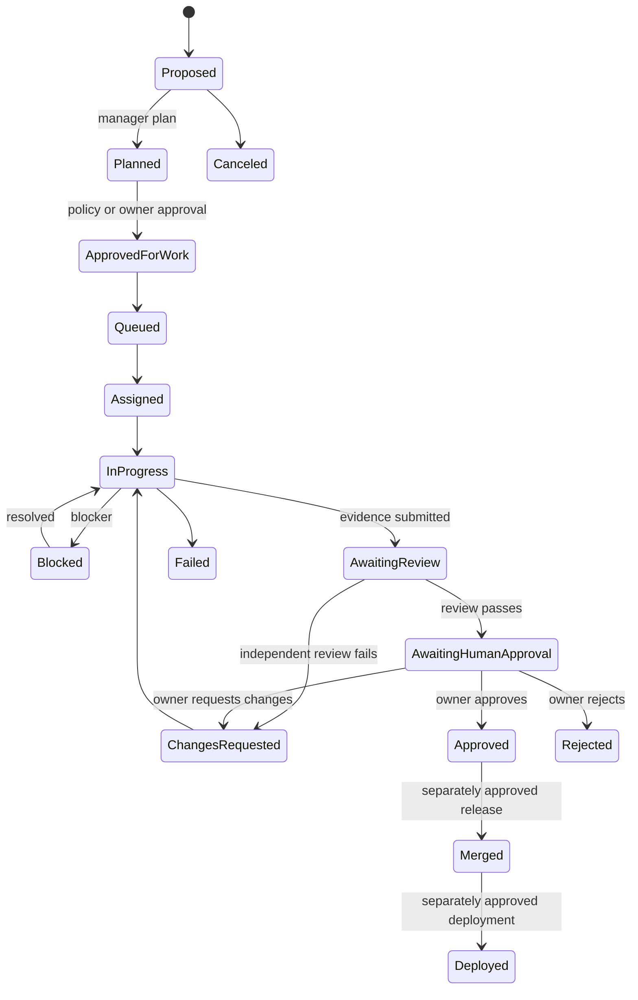
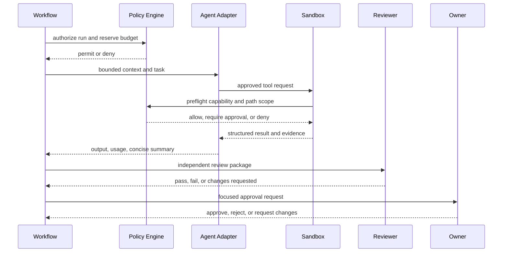

# System Architecture

Status: Proposed
Version: 0.1.0

## Architecture Principles

1. The database and Git are sources of truth; model conversations are not.
2. The control plane owns policy, budgets, state transitions, and approvals.
3. Provider SDKs execute bounded work but do not define company authority.
4. Every side effect is capability-checked, idempotent, and auditable.
5. Planning, execution, review, approval, and release are separate roles.
6. The private Company OS is isolated from the public Followville runtime.
7. Start with a few useful agents and explicit workflows, not a simulated crowd.

## Proposed MVP Components

| Component | Choice | Why it fits | MVP status |
| --- | --- | --- | --- |
| Private dashboard | Next.js, TypeScript | Server-rendered owner UI, Vercel fit | Planned |
| Identity | Existing Supabase Auth plus explicit owner membership | Reuses owner accounts, adds separate authorization | Planned |
| System of record | Postgres/Supabase, private schema | Transactions, RLS, auditability, existing ops knowledge | Schema proposed |
| Durable workflow | Inngest | TypeScript, Vercel fit, events, retries, waits, concurrency | Recommended pilot |
| Agent control plane | Custom TypeScript state machine | Provider-neutral authority and testability | Foundation implemented |
| Model execution | Provider adapters | OpenAI, Anthropic, local/manual adapters remain replaceable | Interface planned |
| OpenAI adapter | OpenAI Agents SDK | Tools, guardrails, handoffs, tracing, sandbox path | Planned after credentials |
| Git integration | GitHub App | Narrow repository permissions and webhook identity | Planned |
| Workspace execution | Ephemeral container/worktree | Isolation, cleanup, repeatable evidence | Planned |
| Observability | Postgres audit ledger plus provider traces | Business truth remains provider-neutral | Schema proposed |
| Object evidence | Private object storage | Screenshots, logs, patches, reports | Planned |

## System Context



## Goal-to-Approval Lifecycle



## Run Lifecycle



## Framework Comparison

| Option | Strengths | Weaknesses for Followville | Recommendation |
| --- | --- | --- | --- |
| Custom control plane | Exact permissions, budgets, approvals, provider neutrality | Must implement state and policy carefully | Own this layer |
| OpenAI Agents SDK | Small primitives, TypeScript, tools, guardrails, handoffs, tracing, sandbox support | OpenAI-centered traces/runtime; not a durable company database | Use behind adapter |
| LangGraph | Checkpoints, interrupts, persistence, replay/time-travel patterns | Adds graph/runtime concepts and likely LangSmith dependence | Re-evaluate for complex agent graphs |
| AutoGen | Mature multi-agent/team patterns, state, human feedback, distributed core | Python-first split from proposed TypeScript control plane; conversational emphasis | Research/prototyping only |
| CrewAI | Accessible roles/crews, flows, state, event patterns, usage metrics | More opinionated agent abstractions; weaker fit for policy-as-source-of-truth | Not selected |

Primary references:

- OpenAI Agents SDK: https://openai.github.io/openai-agents-js/
- LangGraph persistence: https://docs.langchain.com/oss/python/langgraph/persistence
- AutoGen: https://microsoft.github.io/autogen/stable/
- CrewAI Flows: https://docs.crewai.com/en/concepts/flows

## Durable Workflow Comparison

| Option | Operational fit | Tradeoff | Decision |
| --- | --- | --- | --- |
| Inngest | Strong Vercel/TypeScript fit; event, cron, waits, retries, concurrency | New managed dependency; step semantics require idempotency | MVP pilot |
| Trigger.dev | Strong long-running task UX, retries, waits, queues | Another hosted control surface; overlap with agent run UI | Viable alternate |
| Vercel Workflow | Natural hosting fit and low surface area | Higher hosting coupling and newer ecosystem | Reassess after pilot |
| Temporal | Deep durability, event history, signals, years-long workflows | Highest operational and conceptual cost for two founders | Later scale |
| Supabase Queues only | Minimal vendor addition, Postgres-native durability | Pull workers and workflow state/retries remain ours | Good event buffer, not full orchestrator |

Inngest documents event/cron-triggered durable functions, memoized steps,
automatic retries, waits, and concurrency controls. Temporal provides stronger
long-lived deterministic replay but requires stricter workflow/activity design.
For the MVP, the custom state machine remains authoritative even if the durable
workflow provider changes.

References:

- https://www.inngest.com/docs/learn/inngest-functions
- https://www.inngest.com/docs/guides/concurrency
- https://trigger.dev/docs/tasks/overview
- https://docs.temporal.io/workflows
- https://supabase.com/docs/guides/queues

## Model Routing

Routing uses capability classes rather than hard-coded marketing model names:

1. `deterministic`: schemas, rules, queries, no model.
2. `economy`: classification, queue summaries, stale-task checks.
3. `standard`: bounded implementation, research synthesis, routine review.
4. `advanced`: architecture, difficult debugging, security-critical review.
5. `independent_review`: different run and preferably different model/provider.

Every model catalog entry is versioned configuration containing provider,
model ID, capabilities, context limit, price inputs, data-retention posture,
availability, and effective dates. Missing price data blocks paid execution
rather than assuming zero.

## Build Versus Buy

Build the Followville-specific control plane, schemas, policy engine, approval
workflow, audit model, context packaging, and dashboard. Buy or adopt commodity
durable execution, model SDKs, GitHub integration, auth/database hosting, and
object storage. This keeps company authority portable while avoiding a bespoke
queue, auth stack, or model client.

## Repository Direction

The final architecture may become a pnpm monorepo:

```text
apps/
  company-dashboard/
  company-worker/
packages/
  company-domain/
  company-policy/
  company-providers/
  company-github/
  company-observability/
supabase/
  migrations/
company-os/
  docs/
```

Phase 0 stays under `company-os/` to avoid rewriting the working public site
before owners approve the architecture.

## Infrastructure and Cost Posture

- Phase 0 local simulation: USD 0 incremental.
- Database/dashboard pilot: target existing free/included capacity, subject to
  an owner decision on using a separate project.
- Model APIs: disabled by default; budget is USD 0 until configured.
- Durable workflow and evidence storage: use free development allowances only
  after owners verify current provider terms.
- Do not hard-code provider prices. Store dated price catalog records.

The first paid threshold should be an explicit owner-set monthly cap with
warning and hard-stop levels, not a forecast disguised as a guarantee.
